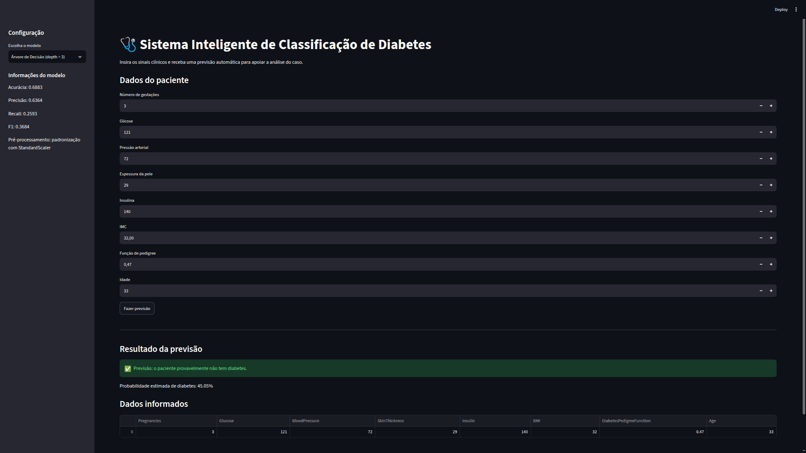

# Projeto de Machine Learning & Predição de Dados 🚀

[](https://www.python.org/)
[](https://scikit-learn.org/)
[](https://pandas.pydata.org/)
[](https://streamlit.io/)

Projeto de Inteligência Artificial voltado para **Análise Exploratória de Dados (EDA)**, **Treinamento de Modelos de Machine Learning** e **Predição de Resultados**, acompanhado de uma interface web interativa para testes e visualizações em tempo real.

---

## 📌 Sobre o Projeto

Este projeto tem como objetivo demonstrar a aplicação prática de algoritmos de Machine Learning na predição da ocorrência de diabetes a partir de informações clínicas dos pacientes.

O projeto contempla todas as etapas do pipeline de aprendizado de máquina, desde o pré-processamento e limpeza dos dados até o treinamento, avaliação dos modelos e disponibilização de uma interface web intuitiva para realização de predições.

Além da implementação dos modelos de Machine Learning, o projeto foi desenvolvido seguindo uma estrutura modular, separando as etapas de pré-processamento, treinamento, avaliação dos modelos e interface web. Também foram utilizados testes automatizados para validação do pipeline, persistência dos modelos treinados e versionamento do código com Git e GitHub, seguindo boas práticas de organização de software e reprodutibilidade do pipeline de Machine Learning.

---

## ✨ Diferenciais

- Estrutura modular para separação das responsabilidades do projeto.
- Pipeline completo de pré-processamento, treinamento e avaliação.
- Persistência dos modelos treinados para reutilização.
- Testes automatizados para validação do pipeline.
- Interface web desenvolvida com Streamlit para realização de predições.
- Possibilidade de selecionar e comparar diferentes modelos de Machine Learning diretamente pela interface.
- Versionamento utilizando Git e GitHub.

---

## 📂 Estrutura do Projeto

```text
predicao-diabetes-machine-learning/
│
├── 📁 dataset/
│   └── diabetes.csv
│
├── 📁 documentos/
│   ├── screenshot-dashboard.png
│   └── relatorio.md
│
├── 📁 models/
│   ├── preprocessed/
│   └── trained/
│
├── 📁 src/
│   ├── 📄 preprocess_diabetes.py
│   ├── 📄 train_models.py
│
├── 📄 app.py
├── 📄 requirements.txt
├── 📄 README.md
└── 📄 .gitignore
```

### 📁 Principais diretórios

* **`dataset/`** — contém o conjunto de dados utilizado no projeto.
* **`documentos/`** — reúne a documentação, relatório técnico e imagens utilizadas no README.
* **`models/`** — armazena os artefatos gerados durante o pipeline, incluindo dados pré-processados e modelos treinados.
* **`src/`** — concentra a implementação do pipeline de Machine Learning, mantendo as responsabilidades separadas entre pré-processamento, treinamento e avaliação.
* **`app.py`** — aplicação web desenvolvida com Streamlit para interação com os modelos e realização de predições.
* **`requirements.txt`** — lista das dependências necessárias para executar o projeto.
* **`README.md`** — documentação principal do projeto.

---

## 📷 Demonstração

<p align="center">

</p>

---

## 📊 Dataset

Foi utilizado o **Pima Indians Diabetes Database**, um conjunto de dados amplamente utilizado em estudos de Machine Learning para classificação. O dataset contém informações clínicas de pacientes, como número de gestações, glicose, pressão arterial, IMC, idade e outras variáveis utilizadas para prever a ocorrência de diabetes.

---

## 🤖 Modelos Utilizados

Foram treinados e comparados quatro modelos de classificação:

- Decision Tree (profundidade 3)
- Decision Tree (profundidade 5)
- Decision Tree (profundidade 7)
- Gaussian Naive Bayes

O objetivo foi comparar modelos com diferentes níveis de complexidade e selecionar aquele com melhor desempenho utilizando métricas de avaliação como Accuracy, Precision, Recall e F1-Score.

---

## 📈 Resultados

Os modelos foram avaliados utilizando as métricas **Accuracy, Precision, Recall** e **F1-Score**.

| Modelo | Accuracy | Precision | Recall | F1-Score |
|---------|---------:|----------:|-------:|---------:|
| Decision Tree (3) | 68,8% | 63,6% | 25,9% | 36,8% |
| Decision Tree (5) | **76,0%** | 63,9% | **72,2%** | **67,8%** |
| Decision Tree (7) | 75,3% | **69,1%** | 53,7% | 60,4% |
| Gaussian Naive Bayes | 70,1% | 56,7% | 63,0% | 59,6% |

A **Árvore de Decisão com profundidade 5** apresentou o melhor desempenho geral, alcançando a maior Accuracy e o maior F1-Score, além do melhor equilíbrio entre Precision e Recall.


### Relátorio Técnico

Para uma análise mais detalhada do projeto, incluindo a comparação entre os modelos, métricas completas, matrizes de confusão e justificativas para a seleção dos algoritmos, consulte o relatório técnico disponível neste repositório.

➡️ [Relatório de Avaliação dos Modelos](documentos/relatorio.md)
---

## 🛠️ Tecnologias e Bibliotecas Utilizadas

- **Linguagem:** Python
- **Manipulação e Análise de Dados:** Pandas, NumPy
- **Visualização de Dados:** Matplotlib, Seaborn
- **Machine Learning:** Scikit-Learn
- **Interface Web / Dashboard:** Streamlit
- **Versionamento:** Git e GitHub

---

## ⚙️ Funcionalidades principais

1. **Análise Exploratória (EDA):** Visualização de distribuições, detecção de *outliers* e análise de correlação entre variáveis.
2. **Pré-processamento de Dados:** Normalização, codificação de variáveis categóricas e tratamento de valores ausentes.
3. **Treinamento & Avaliação:** Aplicação de algoritmos de classificação/regressão com métricas de desempenho (Acurácia, F1-Score, Matriz de Confusão, etc.).
4. **Interface Interativa:** Permite que o usuário insira novos dados e obtenha a predição do modelo instantaneamente.

---

## 🚀 Como Executar o Projeto Localmente

### Pré-requisitos
- Ter o **Python 3.8+** instalado em sua máquina.
- Git instalado.

### Passo a passo

1. **Clonar o repositório:**
   ```bash
   git clone https://github.com/jalmirsiqueira3/projeto-si.git
   cd projeto-si
   ```

2. **Criar e ativar um ambiente virtual (recomendado):**
   ```bash
   # Linux / macOS:
   python3 -m venv .venv
   source .venv/bin/activate

   # Windows:
   python -m venv .venv
   .venv\Scripts\activate
   ```

3. **Instalar as dependências:**
   ```bash
   pip install -r requirements.txt
   ```

4. **Executar a aplicação:**
   ```bash
   streamlit run app.py
   ```

---

## 👨‍💻 Autores

### Jalmir Siqueira
- [GitHub](https://github.com/jalmirsiqueira3)
- [LinkedIn](https://www.linkedin.com/in/jalmir-siqueira-a3221828a)

### Joelmir Siqueira
- [GitHub](https://github.com/joelmirsiqueira)
- [LinkedIn](https://www.linkedin.com/in/joelmir-silva-de-siqueira-815a81332)
