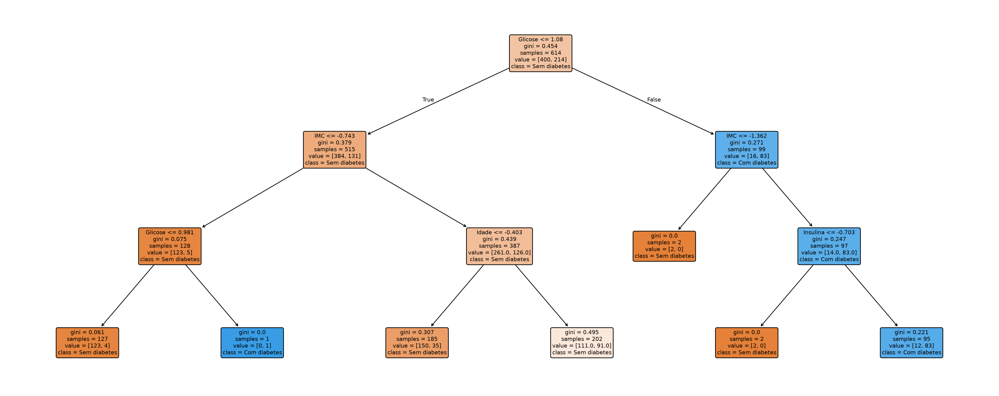
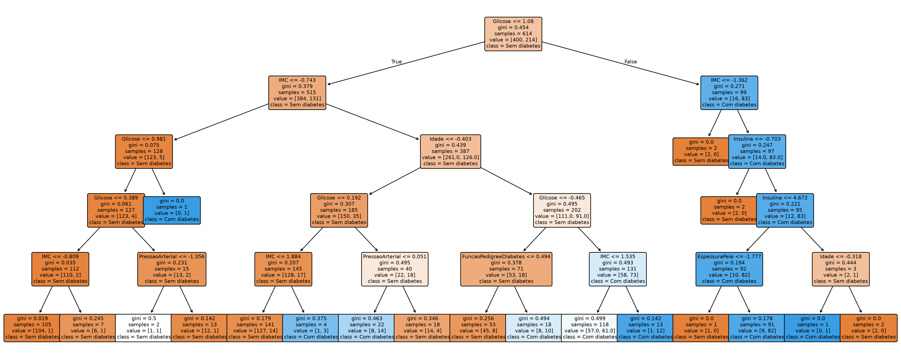
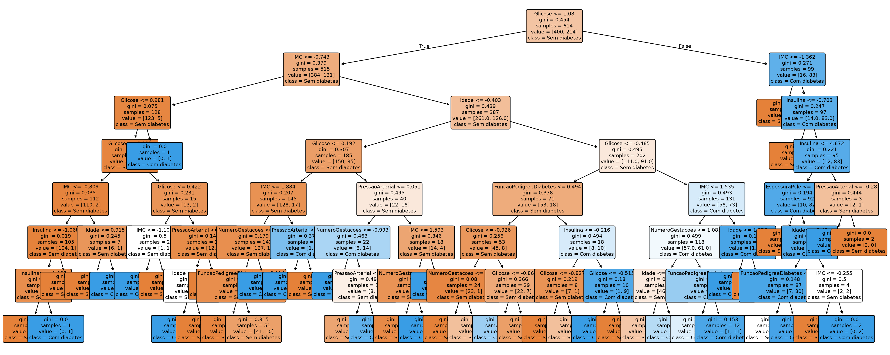
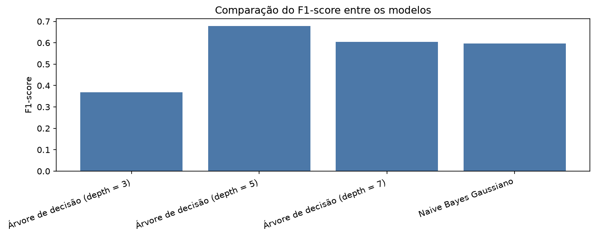
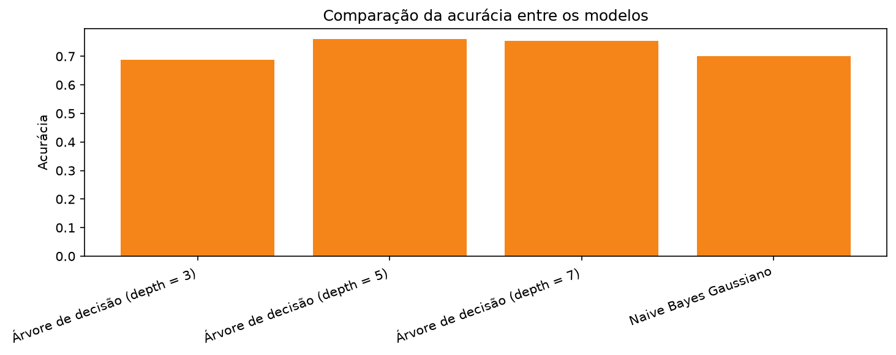

# Apresentação do projeto: classificação de diabetes

## 1. Contexto e objetivo

Este projeto teve como objetivo desenvolver um sistema inteligente capaz de classificar pacientes em duas categorias: com diabetes ou sem diabetes, a partir de características clínicas e demográficas.

A proposta foi construir um pipeline completo de machine learning, iniciando no tratamento dos dados, passando pelo treinamento de modelos e finalizando com a comparação de desempenho entre diferentes abordagens.

O foco principal foi selecionar o modelo mais adequado para este cenário, considerando não apenas a acurácia, mas também a capacidade de identificar corretamente os casos positivos, o que é especialmente importante em aplicações médicas.

---

## 2. Sobre o dataset

O conjunto de dados utilizado é o clássico dataset de diabetes, contendo 768 registros e 9 colunas:

- Número de gestações
- Glicose
- Pressão arterial
- Espessura da pele
- Insulina
- IMC
- Função de pedigree da diabetes
- Idade
- Resultado

A variável alvo é Resultado, que indica:

- 0: sem diabetes
- 1: com diabetes

A distribuição do target no dataset é a seguinte:

- 500 casos da classe 0
- 268 casos da classe 1

Essa distribuição mostra que o problema é ligeiramente desbalanceado, o que torna a análise de métricas como precisão, recall e F1-score ainda mais importante.

---

## 3. Procedimentos realizados no projeto

### 3.1 Análise inicial do dataset

A primeira etapa consistiu em:

- carregar os dados;
- verificar o formato do dataset;
- identificar valores ausentes;
- verificar duplicatas;
- observar a distribuição da variável alvo.

### 3.2 Limpeza e pré-processamento

Foram aplicadas etapas importantes para preparar os dados para o treinamento:

- remoção de registros duplicados;
- substituição de valores inválidos (como zeros em variáveis clínicas importantes) por valores ausentes;
- imputação dos valores ausentes utilizando a mediana;
- padronização das features com StandardScaler;
- divisão dos dados em treino e teste, usando stratify para manter a proporção das classes.

Essa etapa é essencial porque modelos como árvores de decisão e Naive Bayes são sensíveis à escala e à qualidade dos dados.

### 3.3 Treinamento dos modelos

Foram treinados quatro modelos:

1. Árvore de decisão com profundidade 3
2. Árvore de decisão com profundidade 5
3. Árvore de decisão com profundidade 7
4. Naive Bayes Gaussiano

A avaliação foi realizada com base em dados de teste separados, garantindo uma análise mais confiável do desempenho real dos modelos.

---

## 4. Modelos desenvolvidos

### 4.1 Árvore de decisão

A árvore de decisão é um modelo interpretável que organiza decisões em forma de estrutura hierárquica. Ela separa os dados em nós, escolhendo variáveis e limites que melhor diferenciam as classes.

Vantagens:

- facilidade de interpretação;
- visualização simples do processo decisório;
- bom desempenho em problemas tabulares.

Limitações:

- pode overfitar se for muito profunda;
- o desempenho depende do ajuste da profundidade.

### 4.2 Naive Bayes Gaussiano

O Naive Bayes Gaussiano assume que as características seguem uma distribuição normal e calcula a probabilidade de cada classe com base nas observações.

Vantagens:

- simples e rápido;
- requer poucos recursos computacionais;
- costuma ser robusto em bases pequenas.

Limitações:

- assume independência entre as variáveis, o que nem sempre representa a realidade;
- pode ter desempenho inferior a modelos mais flexíveis quando há relações complexas entre características.

---

## 5. Estrutura das árvores de decisão

As árvores foram treinadas após o pré-processamento, com as variáveis já padronizadas. Para facilitar a interpretação, a estrutura abaixo é apresentada em termos dos nomes das colunas em português, como Glicose, IMC, Idade, Pressão arterial e demais características clínicas.

A melhor forma de visualizar a lógica dessas árvores é pensar em cada nó como uma pergunta. A partir da resposta, o modelo segue para outro ramo e, no final, decide se o paciente é classificado como sem diabetes ou com diabetes.

### 5.1 Árvore de decisão com profundidade 3

Essa é a árvore mais simples. Ela faz poucas perguntas antes de classificar o paciente.

Estrutura em forma de perguntas:

1. A característica Glicose está abaixo de um certo limite?
2. Se sim, o IMC ajuda a decidir entre os dois grupos.
3. Em seguida, Glicose e Idade são usados para reforçar a decisão.
4. Se não, a árvore segue por outro caminho e usa IMC e Insulina para concluir a classificação.

Essa estrutura é mais direta, mas também menos detalhada. Por isso, ela consegue captar menos nuances do problema.

### 5.2 Árvore de decisão com profundidade 5

Essa foi a árvore com melhor equilíbrio entre simplicidade e capacidade de separação dos dados.

Estrutura em forma de perguntas:

1. A característica Glicose é o ponto inicial de decisão mais importante.
2. Em seguida, a árvore pergunta se o IMC está em um intervalo específico.
3. A partir daí, novas perguntas são feitas com Glicose, Pressão arterial, Insulina, IMC e Idade.
4. O modelo vai refinando a decisão em vários níveis, mas sem se tornar excessivamente complexo.

Essa árvore é mais rica do que a de profundidade 3, pois faz mais perguntas antes de decidir. Isso permite capturar melhor os padrões do dataset e, por isso, apresentou melhor desempenho geral.

### 5.3 Árvore de decisão com profundidade 7

Essa é a árvore mais detalhada e mais profunda. Ela faz mais perguntas e separa os dados com maior refinamento.

Estrutura em forma de perguntas:

1. A árvore começa, como nas outras, avaliando Glicose.
2. Depois, usa IMC e Idade para dividir os pacientes em subgrupos.
3. Em níveis seguintes, passa a avaliar Número de gestações, Pressão arterial, Insulina, IMC e outras características clínicas.
4. O objetivo é chegar a decisões cada vez mais específicas.

Essa árvore é mais complexa e pode capturar padrões muito detalhados, mas também aumenta o risco de overfitting. Por isso, embora tenha boa precisão, a sua sensibilidade para detectar casos positivos foi menor do que na árvore de profundidade 5.

---

## 6. Métricas de avaliação

As métricas utilizadas para comparar os modelos foram:

- Acurácia: percentual de previsões corretas no geral.
- Precisão: proporção de previsões positivas que realmente estavam corretas.
- Recall: proporção de casos reais positivos corretamente identificados.
- F1-score: média harmônica entre precisão e recall, útil para equilibrar os dois aspectos.

### 6.1 Comparação dos modelos

| Modelo | Acurácia | Precisão | Recall | F1-score |
| --- | ---: | ---: | ---: | ---: |
| Árvore de decisão (depth = 5) | 0.7597 | 0.6393 | 0.7222 | 0.6783 |
| Árvore de decisão (depth = 7) | 0.7532 | 0.6905 | 0.5370 | 0.6042 |
| Naive Bayes Gaussiano | 0.7013 | 0.5667 | 0.6296 | 0.5965 |
| Árvore de decisão (depth = 3) | 0.6883 | 0.6364 | 0.2593 | 0.3684 |

### 6.2 Interpretação dos resultados

- A árvore de profundidade 5 foi a melhor em desempenho geral, apresentando a maior acurácia e o maior F1-score.
- O modelo de profundidade 3 teve desempenho ruim, sobretudo em recall, indicando que deixou de identificar muitos pacientes com diabetes.
- A árvore de profundidade 7 teve boa precisão, mas menor recall, o que sugere que foi mais conservadora na classificação dos positivos.
- O Naive Bayes apresentou desempenho intermediário, sem superar a árvore de profundidade 5.

---

## 7. Matrizes de confusão

As matrizes de confusão ajudam a visualizar melhor os erros cometidos por cada modelo.

### Árvore de decisão (depth = 3)

### Árvore de decisão (depth = 5)

### Árvore de decisão (depth = 7)

### Naive Bayes Gaussiano

Essas matrizes mostram que o modelo de profundidade 5 conseguiu um melhor equilíbrio entre acertos e erros, especialmente na identificação dos casos positivos.

---

## 8. Gráficos de comparação

### Comparação do F1-score

### Comparação da acurácia

---

## 9. Modelo escolhido

O modelo selecionado para este projeto foi a árvore de decisão com profundidade 5.

### Justificativa

- apresentou a maior acurácia;
- apresentou o melhor F1-score;
- apresentou um bom equilíbrio entre precisão e recall;
- foi mais adequado para um cenário de triagem clínica, onde é importante identificar corretamente os casos positivos sem gerar muitos falsos alarmes.

Esse resultado indica que a árvore de profundidade 5 oferece uma solução interpretável, eficiente e mais confiável para o problema proposto.

---

## 10. Pontos-chave para a apresentação

Ao apresentar este projeto, é importante destacar:

1. O problema tratado: classificação de diabetes a partir de características clínicas.
2. A importância do pré-processamento para melhorar a qualidade dos dados.
3. A comparação entre modelos clássicos e a relevância das métricas adequadas.
4. A escolha do modelo com melhor equilíbrio entre precisão e sensibilidade.
5. O valor da interpretabilidade da árvore de decisão para aplicações reais.

---

## 11. Conclusão

O projeto mostrou que é possível construir um pipeline completo de classificação de diabetes com resultados promissores, utilizando técnicas simples, interpretáveis e eficazes. Entre os modelos avaliados, a árvore de decisão com profundidade 5 se destacou como a melhor opção, oferecendo um bom compromisso entre desempenho, interpretabilidade e aplicabilidade prática.
