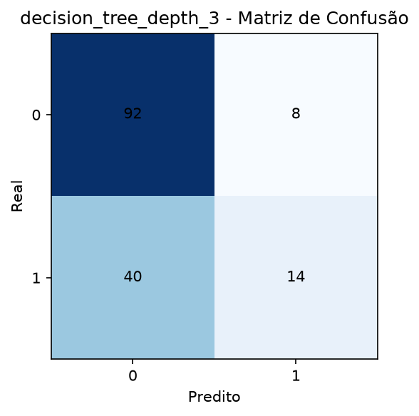
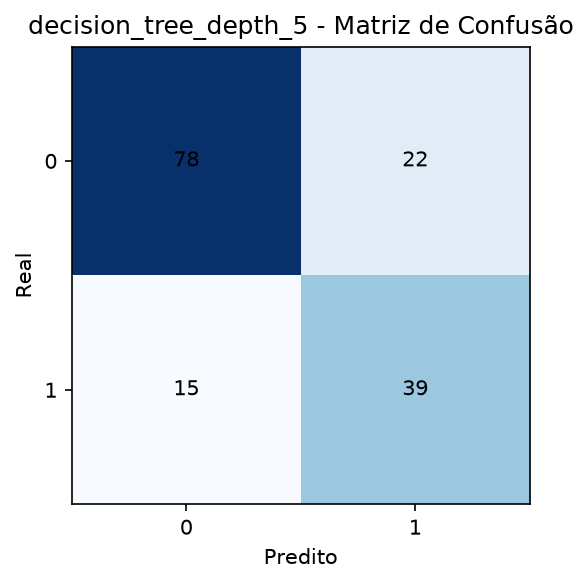
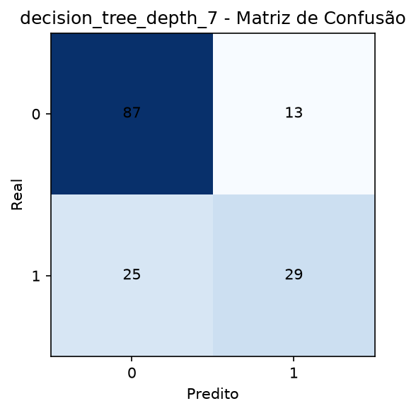
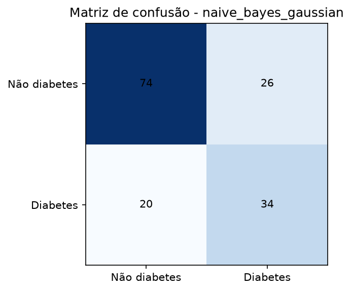

# Relatório de avaliação dos modelos

## Contexto

Este relatório compara quatro modelos de classificação para o problema de predição de diabetes: três versões de árvores de decisão com diferentes profundidades e um classificador Naive Bayes Gaussiano. A avaliação foi realizada com base em métricas clássicas de classificação: acurácia, precisão, recall e F1-score.

## Comparação das métricas

| Modelo | Acurácia | Precisão | Recall | F1-score |
| --- | ---: | ---: | ---: | ---: |
| Árvore de decisão (depth = 3) | 0.6883 | 0.6364 | 0.2593 | 0.3684 |
| Árvore de decisão (depth = 5) | 0.7597 | 0.6393 | 0.7222 | 0.6783 |
| Árvore de decisão (depth = 7) | 0.7532 | 0.6905 | 0.5370 | 0.6042 |
| Naive Bayes Gaussiano | 0.7013 | 0.5667 | 0.6296 | 0.5965 |

## Análise dos resultados

- A árvore de decisão com profundidade 5 apresentou o melhor desempenho geral, com maior acurácia (0.7597) e maior F1-score (0.6783).
- O F1-score é a métrica mais relevante para este cenário, pois equilibra precisão e recall, sendo útil quando queremos identificar corretamente os casos positivos sem aumentar excessivamente os falsos positivos.
- A árvore de profundidade 3 apresentou desempenho inferior, especialmente no recall (0.2593), indicando que ela deixou de identificar muitos pacientes com diabetes.
- A árvore de profundidade 7 apresentou melhor precisão (0.6905) do que a profundidade 5, mas teve recall mais baixo (0.5370), o que sugere que ela foi mais conservadora e perdeu sensibilidade.
- O Naive Bayes Gaussiano ficou em uma posição intermediária, com desempenho inferior ao da árvore de profundidade 5, mas melhor do que a árvore de profundidade 3 em termos de recall e F1-score.

## Modelo selecionado

O modelo escolhido para este cenário foi a árvore de decisão com profundidade 5. Ele foi selecionado porque apresentou o melhor equilíbrio entre precisão e sensibilidade, refletido no maior F1-score, além de ter alcançado a maior acurácia entre os modelos avaliados. Esse resultado torna esse modelo mais adequado para uma aplicação prática de triagem, pois consegue identificar um número maior de casos positivos sem comprometer de forma excessiva a confiabilidade das previsões.

## Gráficos

## Matrizes de confusão

As matrizes de confusão mostram como cada modelo distribuiu os erros entre os casos positivos e negativos.

### Árvore de decisão (depth = 3)

### Árvore de decisão (depth = 5)

### Árvore de decisão (depth = 7)

### Naive Bayes Gaussiano

